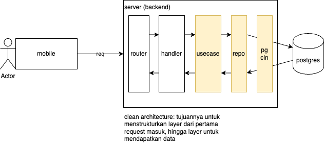

# FGA Kominfo Learning

## Day 8
Membuat 1st Web App (Backend Server):
Membuat user beserta order history dari user

- Membuat Aplikasi 
    - Config
        - harus connect ke DATABASE (postgres)
    - Membuat Domain
        di level ini hanya akan ada interface (method) dan struct (model/entity)
        - User
            - menambahkan user
            - get user detail
        - Order
            - menambahkan order terhadap user
            - mendapatkan semua order dari suatu user
    - Membuat Repository
        layer untuk mendapatkan data, query dan semua yang berhubungan dengan proses mendapatkan data, akan ada di layer ini
        - repo user
        - repo order
    - Membuat Usecase
        layer untuk menjalankan logic (business logic): masking data, checking data, dll
        - usecase untuk user
        - usercase untuk order
    - http server (gin gonic)
        - membuat handler
            layer untuk mendapatkan data yang diberikan oleh client pada suatu request (binding body payload, mendapatkan query paramater)
            - order
            - user
        - membuat router
            layer untuk menamakan API kita (path API kita) sehingga bisa dikenali oleh client: /v1/user, /v1/order
            - order
            - user
        - membuat documentation untuk API 
- Json package
    - apa itu json
    - kenapa json ada
    - json di golang (tag/annotation)
        - json marshall
        - json unmarshall
        - transform from map to struct
- API Documentation (Swagger)
    ketika membuat API, cuma developer yang tau apa
    body payload, header payload yang diperlukan 
    untuk mengakses atau merequest API tersebut
    
    api contract -> memberikan dokumentasi cara penggunaan
    API yang temen temen buat. supaya nanti team FrontEnd
    bisa langsung menggunakan API yang sudah dibuat.

    standard documentation -> OpenAPI
    ref: https://www.openapis.org/

    - Apa itu swagger
        tools yang mempermudah untuk pembuatan API Doc
        ref: https://swagger.io/
    - kenapa swagger ada
        untuk membantu BE team, dalam pembuatan standard API Doc
        yang dapat dibaca oleh semua TEAM dengan format OpenAPI
        ex: xendit, twitter, whatsapp
    - implementasi menggunakan swaggo

---
