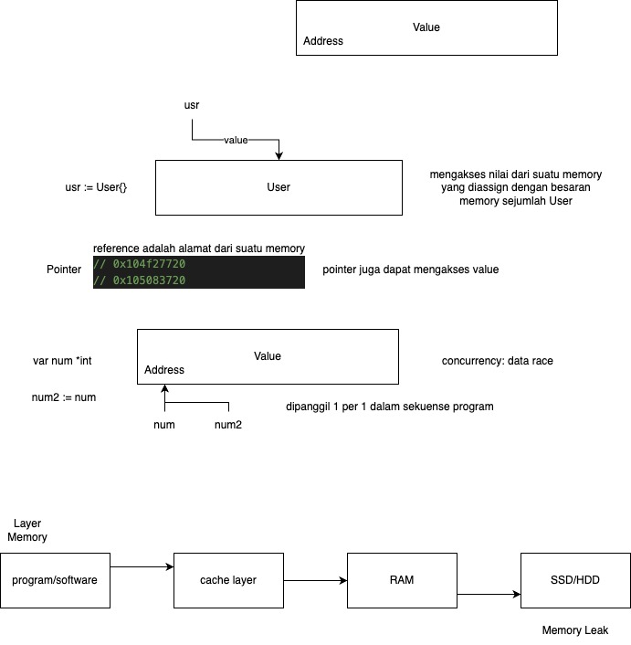

# FGA Kominfo Learning

## DAY 3
- Function
- Closure & Callback
- Pointer
- Struct
- Variable Scope

---
Notes:

Function:
input -> output
x -> [x] -> y

Variable Scope
-> ditandakan dengan huruf kapital pada setiap deklarasi
    -> huruf kapital => variable/function/constant/struct bisa diakses oleh pkg lain
    -> huruf lower case => variable/function/constant/struct bersifat private hanya untuk pkg tersebut

Init Function:
-> setiap package yang dipanggil oleh package main
dan memiliki init function, go akan menjalankan 
semua init function terlebih dahulu
sebelum menjalankan main function

Pointer:
-> sering terjadi "invalid nil memory address"

---
References:
- https://medium.com/@anar_py/option-pattern-in-go-944eda01677a

---
